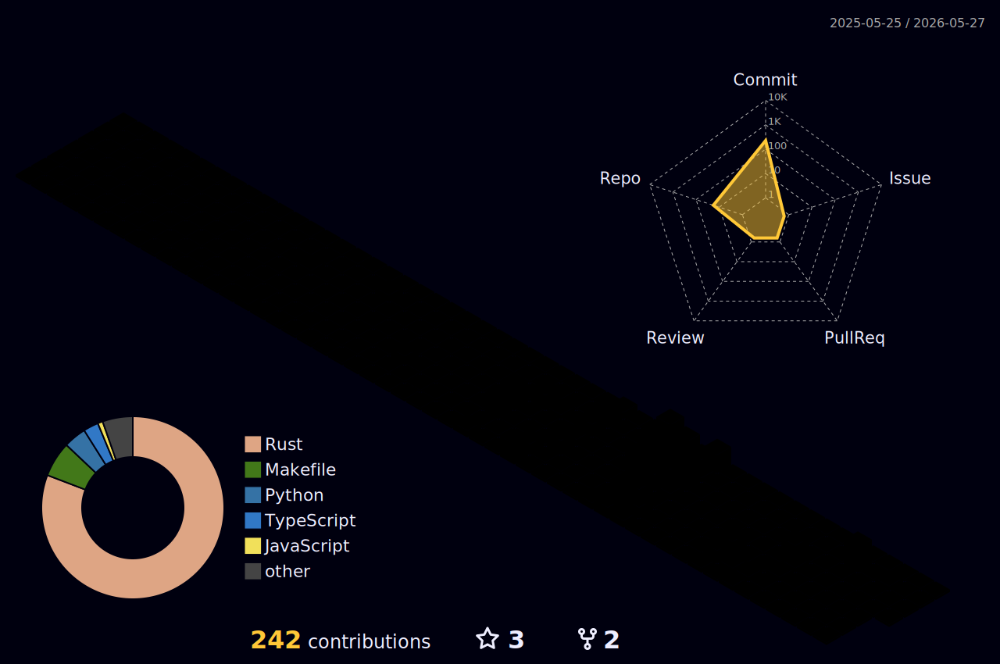

<!-- HERO -->

  

  

  

---

## About

I build systems at the intersection of blockchain, data, and intelligent software.  
Focused on practical infrastructure, clean engineering, and products that actually survive contact with reality.

- Blockchain and protocol engineering
- Data analysis, machine learning, and applied AI
- Full-stack development for real products
- Building [Ouroboros Network](https://github.com/ouroboros-network)

---

## What I'm working on

<table>
<tr>
<td width="50%">

### Current focus
- Ouroboros blockchain infrastructure
- Fintech and AI-powered applications
- Scalable backend systems
- Data workflows and model-driven tools

</td>
<td width="50%">

### What I care about
- Strong architecture
- Security and reliability
- Developer experience
- Shipping useful systems

</td>
</tr>
</table>

---

## Tech stack

  

  

---

## Featured work

  
  

---

## GitHub stats

  
  

  

---

## My Git City

  

---

## Connect

  
  
  

  <i>Built with discipline, curiosity, and the usual amount of human overconfidence.</i>

